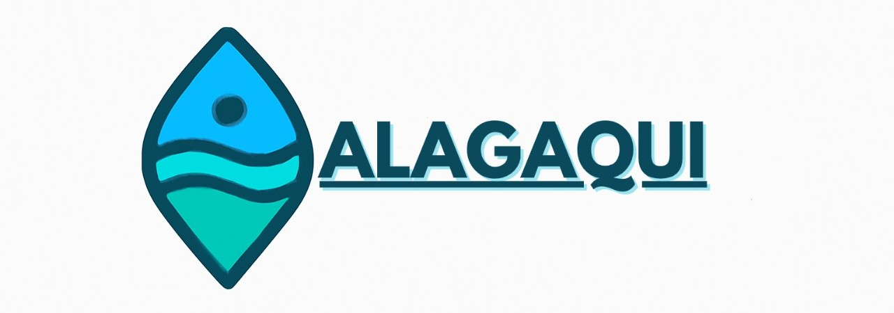

  

---
O **Alagaqui** é um projeto inovador desenvolvido por mim juntamente com [**Alexsandro Macedo**](https://www.linkedin.com/in/alexsandro-macedo-jesus/) e [**Leonardo Salazar**](https://www.linkedin.com/in/lfsalazaar/) para a Global Solution do primeiro semestre de 2025, com o objetivo de enfrentar um dos maiores desafios urbanos de São Paulo: as enchentes. A solução consiste em uma plataforma completa que monitora pontos de alagamento em tempo real, alertando cidadãos e ajudando na prevenção de danos.

### Como Funciona?

Nossa plataforma opera com um sistema duplo de coleta de dados para garantir máxima precisão e agilidade:

- **Mapeamento Colaborativo:** Através de um aplicativo intuitivo, os próprios usuários podem reportar e marcar em um mapa, em tempo real, os locais que estão alagados. Essa funcionalidade cria uma rede de informação comunitária, permitindo que as pessoas evitem rotas afetadas e se mantenham seguras.
- **Sistema IoT Integrado:** Para automatizar o monitoramento, desenvolvemos um sistema IoT composto por sensores ultrassônicos e de boia (float switch) acoplados a uma placa `ESP32`. Esses dispositivos são estrategicamente instalados em bueiros e bocas de lobo e, ao detectarem a elevação do nível da água, enviam um alerta automático para a nossa central, marcando o ponto de alagamento no mapa sem a necessidade de intervenção humana.

Além do monitoramento em tempo real, o Alagaqui gera um histórico de ocorrências e um mapa de calor, que permite a visualização das áreas com maior incidência de alagamentos na cidade, tornando-se uma ferramenta valiosa para o planejamento urbano e para os cidadãos.

---

### Tecnologias Utilizadas

Para a construção deste projeto robusto e multidisciplinar, utilizamos um conjunto de tecnologias de ponta:

- **Aplicativo Mobile:** Desenvolvido em `React Native`, garantindo uma experiência de usuário fluida e compatível com múltiplas plataformas.
- **Backend:** A estrutura do servidor foi construída em `Java` com `Spring Boot`, oferecendo uma base sólida, escalável e de alta performance.
- **Banco de Dados:** Utilizamos um banco de dados `Oracle`, com gerenciamento via `SQLDeveloper`, para armazenar e consultar os dados de forma segura e eficiente.
- **Hardware (IoT):** O sistema de sensores foi implementado com a placa `ESP32`, programada para realizar a leitura dos sensores e a comunicação com o nosso backend.
- **Ambiente e Testes:** O projeto também incluiu o uso de `Java` e `C#` em `.NET` (com Visual Studio) e a criação de um `Dockerfile` para facilitar a configuração de ambientes de teste e garantir a integridade da aplicação.

O Alagaqui é uma demonstração de como a integração entre software, hardware e a colaboração da comunidade pode gerar soluções de grande impacto para a sociedade.

---
> [!IMPORTANT]
> #### 🚧 ESTOU AGRUPANDO OS ARQUIVOS, VOLTE EM BREVE E TUDO ESTARA AQUI! 🚧
